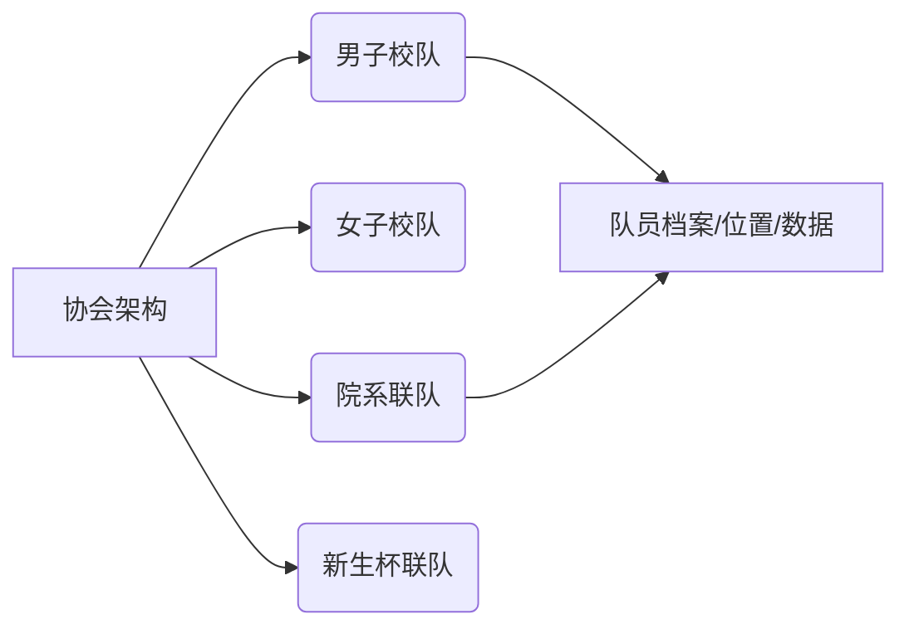

## 深圳技术大学足球协会官方网站项目文档

### 一、项目概述
**目标**：打造专业、活力、实用的足球协会门户网站，服务校内师生及足球爱好者  
**定位**：信息发布平台 + 活动管理中心 
**核心价值**：推广足球文化 | 组织赛事活动 | 连接足球爱好者

---

### 二、核心功能模块
#### 1. 首页（动态展示）
- 轮播Banner（重大赛事/招新海报）
- 本周赛事预告卡片
- 新闻快讯（最新3条）
- 协会荣誉墙（奖杯展示）
- 快速入口（报名/赛程/图库）

#### 2. 赛事中心
- 赛程日历（可视化日历组件）
- 实时比分系统（管理员后台更新）
- 赛事档案（历史赛事数据查询）
- 在线报名通道（表单收集+状态查询）

#### 3. 球队矩阵


#### 4. 媒体库
- 赛事图集（分类：训练/比赛/活动）
- 精彩视频（进球集锦+教学视频）
- 战报下载（PDF赛事报告）
#### 5. 后台管理
- 内容管理（新闻/赛程发布）
- 报名审核（可视化名单管理）
- 数据看板（访问量/报名趋势）

---

### 三、技术方案
**前端架构**：
```javascript
Vue3
◾ 状态管理：Pinia
◾ UI框架：TailwindCSS + InspiraUI
◾ 动画库：Motion
◾ 路由：Vue Router 6
```

**后端服务**：
```python
FastAPI 框架（Python）
◾ 数据库：MySQL（球队/数据）+ Redis（缓存）
◾ 文件存储：阿里云OSS（媒体资源）
```

**特色技术实现**：
1. 赛事日历：FullCalendar 组件 + iCalendar 导出
2. 实时通知：WebSocket 比分推送
3. 移动适配：CSS Grid 响应式布局（断点：768px/1024px）
4. 性能优化：动态导入 + 图片懒加载

---

### 四、设计规范
**视觉系统**：
```color-palette
主色：
辅色：
字体：
```

**交互原则**：
1. 赛事信息≤3次点击可达
2. 关键操作（报名/查询）移动端优先设计
3. 动态数据加载骨架屏（Skeleton UI）

**素材要求**：
- 图片：≥1920×1080 赛事摄影
- 视频：H.264编码 MP4格式
- Logo：提供AI矢量源文件

---

### 五、开发里程碑
| 阶段     | 周期  | 交付物 |
| ------ | --- | --- |
| 原型设计   |     |     |
| 核心功能开发 |     |     |
| 内容填充   |     |     |
| 测试优化   |     |     |
| 上线部署   |     |     |

---

### 六、运维计划
1. **内容更新**：CMS后台培训
2. **安全策略**：
   - 每周漏洞扫描
   - 自动备份（数据库+文件）
3. **推广方案**：
   - 微信小程序轻量版同步开发
   - 线下活动二维码导流
4. **数据指标**：
   ```metrics
   ◾ 月活跃用户 ≥ 800
   ◾ 赛事报名转化率 ≥ 30%
   ◾ 平均访问时长 ≥ 2.5分钟
   ```

---

### 七、附录

> 项目启动建议：优先开发最小可用版本（MVP），包含赛事日历+新闻发布功能，2周内上线试运行，后续迭代会员系统。

[ 备注 ] 此文档需配合Pixso原型设计稿及API接口文档使用